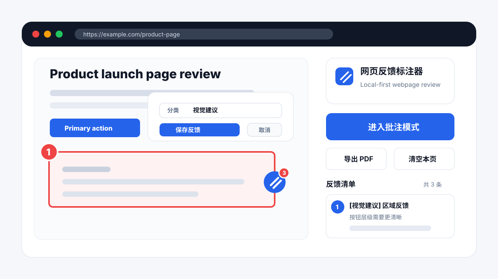

# 网页反馈标注器

网页反馈标注器是一个本地优先的 Chrome Manifest V3 扩展，用于在网页走查、内容审核、产品验收和视觉检查时直接添加反馈标记，并导出包含图文证据的 PDF 反馈报告。

项目也可称为 Web Feedback Marker，核心定位是本地优先、低权限、可导出报告的网页反馈标注工具。



## 项目状态

当前项目处于 MVP 阶段，已经支持 Chrome 开发者模式本地加载、网页内批注、局部截图证据和 PDF 导出。项目优先保证本地运行、低权限和隐私边界清晰。

## 项目背景

网页走查反馈经常分散在截图、聊天记录和手写文档里，问题位置、反馈内容和修改建议容易脱节。网页反馈标注器希望把这件事收敛到浏览器里完成：在页面上直接标记问题，保存上下文截图，再导出一份结构化反馈报告。

## 功能特性

- 在当前网页中边浏览边批注。
- 支持文本反馈、区域框选反馈、标记点反馈。
- 页面内保留低打扰编号标记，悬停或点击后查看反馈内容。
- 支持截图证据，区域截图会保留上下文边距。
- 支持导出本地 PDF 反馈报告，包含报告摘要、反馈内容和证据截图。
- 支持删除单条反馈，并同步更新页面标记和导出内容。
- 页面内铅笔悬浮入口支持拖动、侧边吸附、半隐藏，并尽量避让网页已有悬浮组件。
- 所有数据只保存在 `chrome.storage.local`。
- 不接入 AI API、不做云同步、不做账号系统、不采集统计数据。

## 适用场景

- 内容团队检查页面文案、链接、结构和表达问题。
- 产品或运营对线上页面做走查反馈。
- 设计和前端沟通视觉区域调整建议。
- QA 在网页验收时记录可视化问题。
- 团队需要轻量、本地、低权限的网页反馈工具。

## 本地安装

1. 下载或克隆本项目。
2. 打开 Chrome：`chrome://extensions/`。
3. 开启右上角“开发者模式”。
4. 点击“加载已解压的扩展程序”。
5. 选择本项目根目录。

加载后，点击浏览器工具栏中的扩展图标即可使用。

## 使用方式

1. 打开需要走查的网页。
2. 点击扩展图标。
3. 点击“进入批注模式”。
4. 页面右下角会出现铅笔悬浮球。
5. 从悬浮球选择“框选区域 / 添加标记 / 文本反馈”。
6. 填写问题分类和反馈内容后保存。
7. 页面上会保留编号标记。
8. 在扩展弹窗或页面悬浮菜单中导出 PDF。

## 快捷键

快捷键只在非输入状态下触发，避免影响正常编辑。

| 快捷键 | 操作 |
| --- | --- |
| `Ctrl+Alt+1` | 框选区域 |
| `Ctrl+Alt+2` | 添加标记 |
| `Ctrl+Alt+3` | 文本反馈 |
| `Ctrl+Alt+E` | 导出当前页 PDF |
| `Esc` | 取消当前动作或关闭菜单 |

## 反馈分类

- 内容错误
- 表达不清
- 结构问题
- 链接问题
- 视觉建议
- 其他

## PDF 导出

导出的 PDF 面向真实协作沟通场景，默认包含：

- 页面标题和 URL。
- 导出时间。
- 当前页反馈数量。
- 每条反馈的标注点编号、分类、类型、时间和反馈内容。
- 对应的局部截图证据。
- PDF 页脚和页码。

PDF 文件名格式：

```text
网页名称前 20 个字符 - yyyyMMdd - HHmm - 反馈标注.pdf
```

报告采用信息流布局，固定展示“网页反馈标注报告”，并以“标注点 x”为每条反馈的主入口。页面来源和反馈时间弱化为辅助信息，反馈内容和截图证据优先展示。截图会按原始比例缩放展示，避免横图、竖图或长图被拉伸变形。

## 隐私说明

网页反馈标注器默认本地运行。

- 页面标题、URL、反馈内容、引用文字和截图保存在 `chrome.storage.local`。
- 数据不会上传到服务器。
- 不接入 AI API。
- 不使用云同步。
- 不需要登录账号。
- 不包含第三方分析 SDK。

完整说明见 [PRIVACY.md](PRIVACY.md)。

## 权限说明

当前扩展只声明最小必要权限：

| 权限 | 用途 |
| --- | --- |
| `activeTab` | 在用户主动使用扩展时读取当前标签页信息 |
| `scripting` | 向当前网页注入批注交互脚本 |
| `storage` | 在浏览器本地保存反馈数据 |

## 项目结构

```text
.
├── assets/icons/              # 插件图标
├── docs/                      # UI 规范和开源说明
├── src/
│   ├── background.js          # MV3 后台 service worker
│   ├── content.js             # 页面批注浮层和交互
│   ├── pdf.js                 # 本地 PDF 导出
│   ├── popup.css              # 插件弹窗样式
│   ├── popup.html             # 插件弹窗结构
│   └── popup.js               # 插件弹窗逻辑
├── manifest.json              # Chrome Manifest V3 配置
├── PRIVACY.md                 # 隐私说明
├── CONTRIBUTING.md            # 贡献指南
├── SECURITY.md                # 安全说明
├── CHANGELOG.md               # 版本记录
└── LICENSE                    # MIT 许可证
```

发布前回归测试见 [docs/TEST_CASES.md](docs/TEST_CASES.md)。

## 开发说明

当前项目不需要构建步骤。修改文件后：

1. 打开 `chrome://extensions/`。
2. 点击扩展卡片上的重新加载。
3. 刷新测试网页。
4. 验证批注、存储、清空和 PDF 导出行为。

建议手动回归检查：

- 只有文本反馈场景显示引用文本。
- 标记点反馈和区域反馈不显示过期引用内容。
- 页面边缘附近的反馈填写卡片不会超出视口。
- 清空当前页后，弹窗列表和页面标记都同步清除。
- PDF 截图保持原始比例，不被拉伸变形。

## 路线图

- 补充更完整的回归测试。
- 支持批注数据导入和导出。
- 在保持简单和隐私边界清晰的前提下，评估轻量协作能力。

## 维护重点

后续维护重点：

- 保持 Manifest V3 权限最小化。
- 提升 PDF 导出稳定性。
- 增加批注边界场景的回归测试。
- 保持本地优先的隐私模型清晰、可验证。

## 参与贡献

欢迎提交 issue 和 pull request。参与贡献前，请先阅读 [CONTRIBUTING.md](CONTRIBUTING.md)。

## 许可证

本项目使用 MIT 许可证，详见 [LICENSE](LICENSE)。
